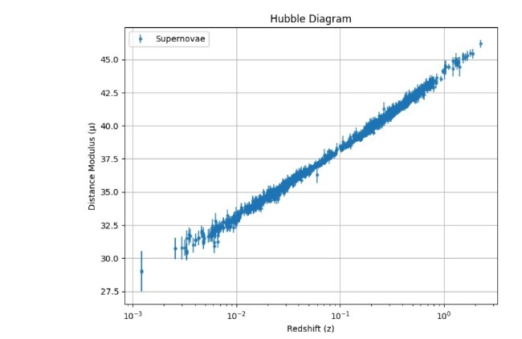
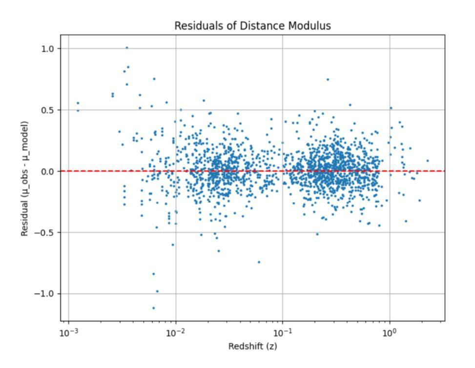

# Supernova Cosmology using Type Ia Supernovae

Estimating cosmological parameters using observational Type Ia supernova data.

<h2>Hubble Diagram</h2>

  

<h2>Residual Analysis</h2>

  

## Highlights

* Estimated H₀ = 72.97 ± 0.17 km/s/Mpc
* Estimated Ωₘ = 0.351 ± 0.012
* Estimated Age of the Universe = 12.36 Gyr
* Analyzed real Type Ia Supernova observations from the Pantheon+SH0ES dataset
* Implemented a Flat ΛCDM cosmological model in Python

## Project Overview

This project uses observational supernova data from the Pantheon+SH0ES sample to estimate:

* Hubble Constant (H₀)
* Matter Density Parameter (Ωₘ)
* Age of the Universe

## Methodology

1. Load and clean Pantheon+SH0ES supernova data
2. Construct the Hubble Diagram (Distance Modulus vs Redshift)
3. Implement the Flat ΛCDM cosmological model
4. Fit cosmological parameters using nonlinear least-squares optimization
5. Estimate the age of the Universe through numerical integration
6. Analyze residuals to evaluate model performance
7. Compare low-redshift and high-redshift estimates of H₀

## Results

| Parameter            | Value                 |
| -------------------- | --------------------- |
| Hubble Constant (H₀) | 72.97 ± 0.17 km/s/Mpc |
| Matter Density (Ωₘ)  | 0.351 ± 0.012         |
| Age of Universe      | 12.36 Gyr             |

### Low-z vs High-z Comparison

| Sample           | H₀             |
| ---------------- | -------------- |
| Low-z (z < 0.1)  | 73.22 km/s/Mpc |
| High-z (z ≥ 0.1) | 71.05 km/s/Mpc |

The results show good agreement with current cosmological measurements while highlighting the ongoing Hubble Tension between local and global estimates of the Hubble Constant.

## Residual Analysis

The residuals are randomly distributed around zero with no significant systematic trend, indicating a good fit between the observational data and the cosmological model.

## Technologies Used

* Python
* NumPy
* Pandas
* SciPy
* Matplotlib
* Astropy
* Jupyter Notebook

## Repository Contents

* Cosmological analysis notebook
* Pantheon+SH0ES dataset
* Hubble diagram visualization
* Residual analysis visualization
* Detailed project report (Summer_Project_Report.pdf)

## Project Report

The complete internship report can be found in:

`Summer_Project_Report.pdf`

## Future Work

* Incorporate additional cosmological datasets
* Explore alternative cosmological models
* Investigate sources of Hubble Tension
* Extend analysis to Bayesian parameter estimation

## References

* Pantheon+SH0ES Supernova Dataset
* Planck18 Cosmological Results
* Astropy Documentation
* SciPy Documentation

## Author

Jatin Vats
